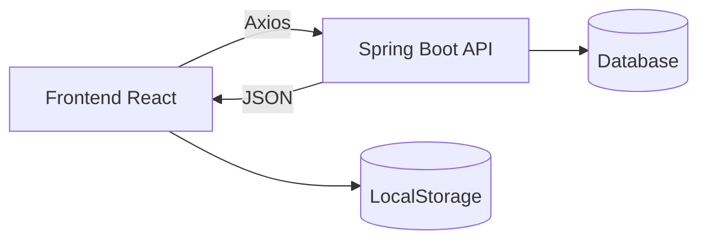
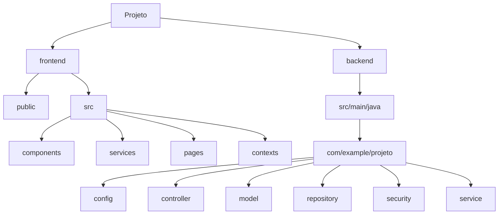
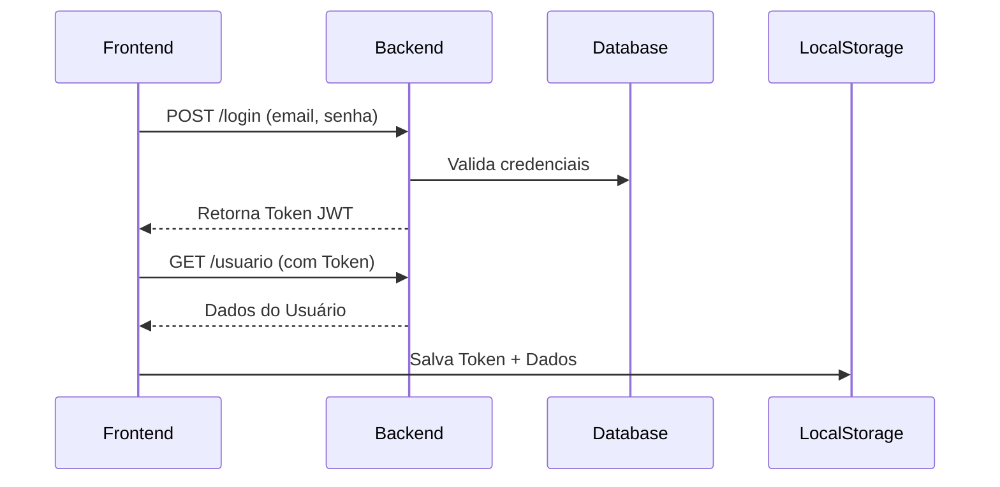

# **Integração Frontend + Backend**  
### (React + Spring Boot REST API)

<div align="center">
   
  
  
  
  
</div>

<br>

Neste tutorial, será explicar como integrar um projeto   React (frontend) com  Spring Boot (backend), utilizando:
-  Postman (ferramenta para testar APIs, enviar requisições HTTP e verificar respostas)
-  Docker (plataforma para criar, executar e gerenciar aplicações em containers isolados)
-  API REST (conjunto de regras que permitem a comunicação entre frontend e backend, seguindo o padrão REST)

---

## **🔧 Arquitetura do Sistema**  

O sistema segue uma arquitetura **cliente-servidor**, onde:  
-  **Frontend (React):**  
  - Consome a API via **Axios** (biblioteca para requisições HTTP).  
  - Armazena dados temporários no **LocalStorage** (para sessão do usuário, tokens JWT, etc.).  
  - Renderiza a interface com base nas respostas da API.  

-  **Backend (Spring Boot):**  
  - Expõe endpoints REST (**GET, POST, PUT, DELETE**).  
  - Processa requisições, aplica regras de negócio e se comunica com o banco de dados.  
  - Retorna respostas em **JSON**, que são consumidas pelo frontend.  

- **Ferramentas de Apoio:**  
  - **Postman:** Testa endpoints da API antes da integração com o frontend.  
  - **Docker:** Containeriza a aplicação para facilitar deploy e ambiente de desenvolvimento.  



---

## **📂 Estrutura de Pastas (Tree View)**  



```bash
PROJETO/
├── frontend/
│   ├── public/
│   ├── src/
│   │   ├── assets/            # Imagens/fontes
│   │   ├── components/        # Componentes reutilizáveis
│   │   ├── contexts/          # Contextos React (AuthContext)
│   │   ├── hooks/             # Custom hooks
│   │   ├── pages/             # Telas da aplicação
│   │   ├── services/          # Conexão com API (axios)
│   │   ├── styles/            # CSS global
│   │   └── App.js             # Roteamento principal
│   └── Dockerfile
└── backend/
    ├── src/main/java/
    │   └── com/seuprojeto/
    │       ├── config/        # SecurityConfig, Swagger
    │       ├── controller/    # RestControllers
    │       ├── dto/           # Objetos de transferência
    │       ├── exception/     # Handlers de erro
    │       ├── model/         # Entidades JPA
    │       ├── repository/    # JPA Repositories
    │       ├── security/      # JWT filters
    │       └── service/       # Lógica de negócio
    ├── src/main/resources/
    │   ├── application.yml    # Configurações
    │   └── data.sql          # Dados iniciais
    └── Dockerfile
```

---

## **🚦 Fluxo de Autenticação**  

### **1. Login (POST)**
<div align="center">
  
</div>

**Frontend Code** (`authService.js`):  
```jsx
// 🚀 Método de Login
async function login(email, senha) {
  const response = await axios.post(
    'http://localhost:4201/api/auth/login',
    { email, senha } // 📦 Body JSON
  );
  return response.data; // 🔑 Token + User Data
}
```

**Request/Response Example:**  
```http
POST /api/auth/login HTTP/1.1
Content-Type: application/json

{
  "email": "user@example.com",
  "senha": "123456"
}
```
```json
{
  "token": "eyJhbGciOiJ...",  // 🔐 JWT Token
  "user": { "id": 1, "nome": "Fulano" }
}
```

---

### **2. Token JWT Explained**  
<div align="center">
  
</div>

**Estrutura do Token:**  
```json
{
  "sub": "user@email.com",  // 📧 Email
  "id": 1,                  // 🆔 User ID
  "userlevel": true,        // ✅ Email verificado?
  "admlevel": false,        // 👑 Admin?
  "ativo": true             // 🟢 Conta ativa?
}
```

**Validações Importantes:**  
- `userlevel: false` → Mostrar alerta: *"E-mail não verificado!"* ❌  
- `ativo: false` → Bloquear acesso: *"Conta desativada!"* ⛔  

---

### **3. Buscar Dados do Usuário (GET)**  
<div align="center">
  
</div>

**Requisição com Token:**  
```jsx
const getUser = async (id) => {
  const response = await axios.get(
    `http://localhost:4201/api/usuario/${id}`,
    { headers: { 
        Authorization: `Bearer ${token}`  // 🔑 Token no Header
      } 
    }
  );
  return response.data;
};
```

**Exemplo de Resposta:**  
```json
{
  "id": 1,
  "nome": "Fulano",
  "email": "fulano@email.com",
  "admlevel": false,
  "_links": { /* ... */ }
}
```

---

## **📦 Armazenamento no Frontend**  
<div align="center">
  
</div>

**Salvando em LocalStorage:**  
```jsx
localStorage.setItem('auth', JSON.stringify({
  token: "eyJhbGci...",  // 🔐
  user: { id: 1, nome: "Fulano" }  // 👤
}));
```

---

## **🔧 Ferramentas Utilizadas**  

| Tecnologia       | Ícone | Descrição          |
|------------------|-------|--------------------|
| **React**        |  | Biblioteca Frontend |
| **Axios**        |  | Cliente HTTP |
| **Spring Boot**  |  | Backend Java |
| **JWT**          |  | Autenticação |

---

## **🎨 Diagrama Completo**  


---
